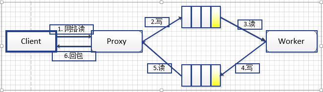

#                                                       EVP RPC说明

### 模块说明：

这个小组件主要细分为2个模块：

proxy:  负责网络通讯，接受网络包后按自定义协议解析网络包，塞入worker共享内存读队列供worker消费，同 

​             时从worker共享内存写队列读包，转发到网络客户端。

worker: 负责业务逻辑处理，消费worker共享内存读队列消息，根据业务逻辑处理请求，将应答写入worker共享

​               内存写队列。

模块整体采用多进程方式，proxy启一个进程负责网络通信，worker可启多个进程处理比较费时的网络连接。

模块整体架构架构借鉴腾讯SPP架构模式， 但是暂时未提供SPP有的异步实现方式， 因此代码比较简洁（尽量按C++模式思想实现）。

### 运行测试：

./evp_proxy   ../etc/proxy.xml  

./evp_worker ../etc/worker.xml 1

a.out tpc.out  测试用简单回显的demo.   

因时间精力及能力有限，代码中难免有纰漏，如有问题欢迎交流：buluse_01@163.com

